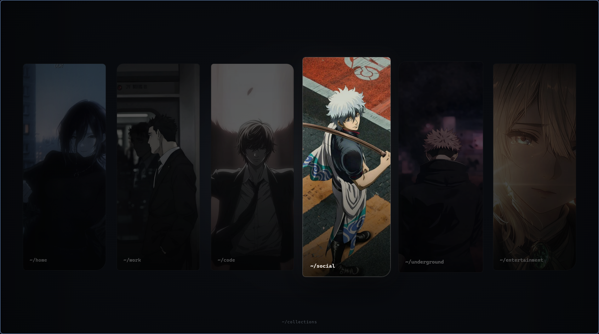
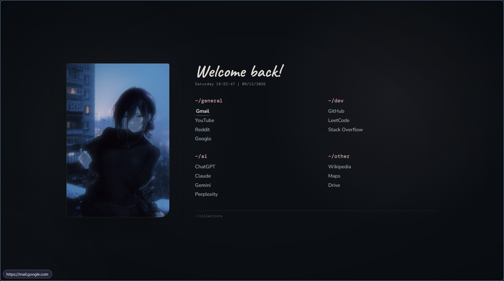
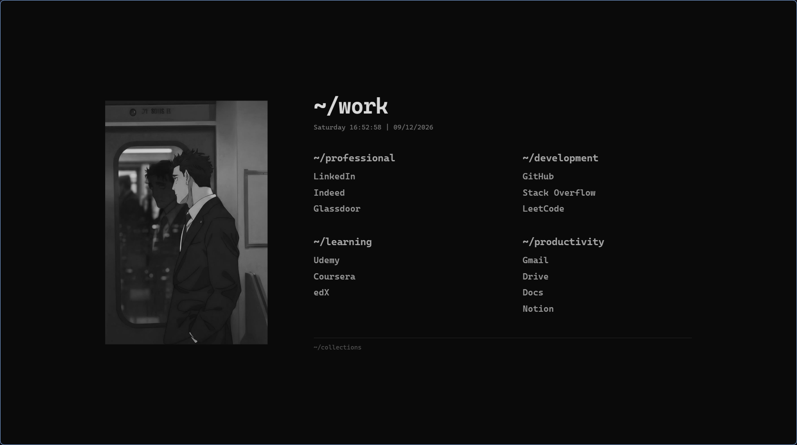
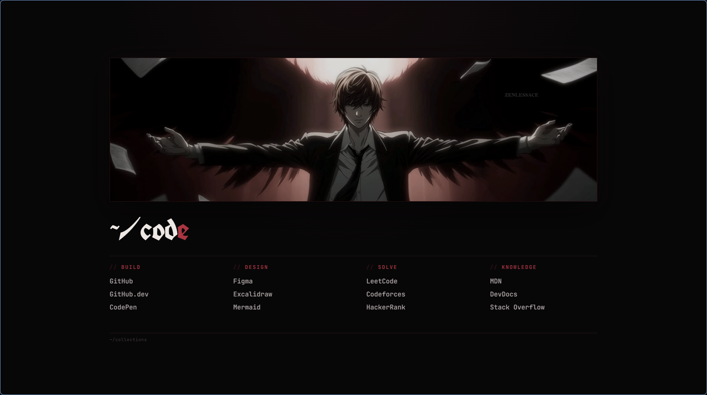
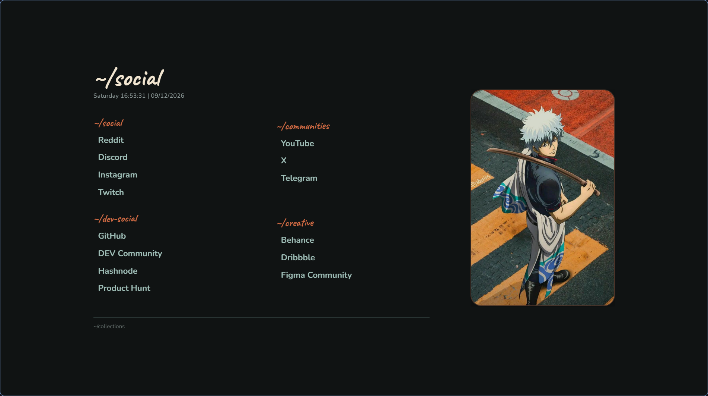
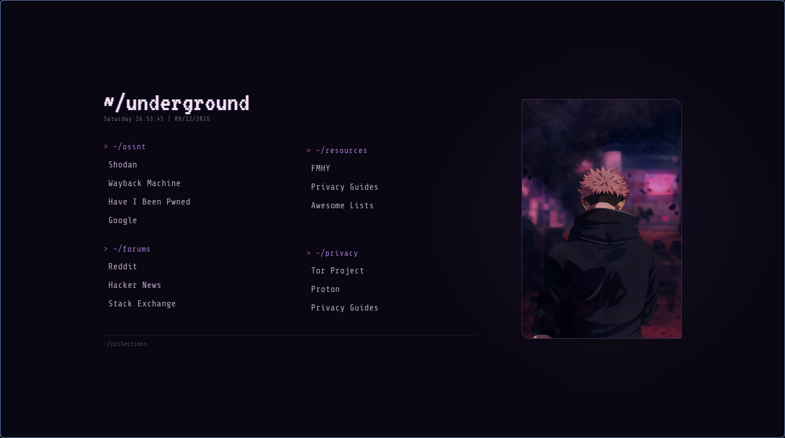
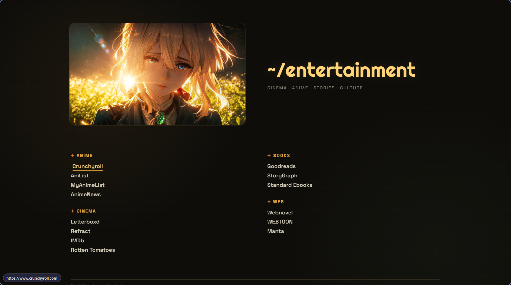

# Web Dashboard

A personal keyboard-first browser dashboard for organizing frequently used websites into themed collections.

The dashboard is designed as a lightweight, static start page with separate visual environments for different areas such as work, development, entertainment, social platforms, and personal resources.

---

## Screenshots

### Collections



### Dashboards

<table>
  <tr>
    <td align="center">
      <strong>Home</strong><br><br>
      
    </td>
    <td align="center">
      <strong>Work</strong><br><br>
      
    </td>
  </tr>
  <tr>
    <td align="center">
      <strong>Code</strong><br><br>
      
    </td>
    <td align="center">
      <strong>Social</strong><br><br>
      
    </td>
  </tr>
  <tr>
    <td align="center">
      <strong>Underground</strong><br><br>
      
    </td>
    <td align="center">
      <strong>Entertainment</strong><br><br>
      
    </td>
  </tr>
</table>
---

## Features

- Themed dashboard environments
- Keyboard-first navigation
- Persistent last-dashboard selection
- Direct access to frequently used websites
- Responsive layout
- Lightweight static implementation
- No backend or build system required
- LocalStorage-based dashboard state

---

## Navigation

The dashboard can be navigated primarily using the keyboard.

| Key | Action |
|---|---|
| `h` / `←` | Previous dashboard or item |
| `l` / `→` | Next dashboard or item |
| `Enter` | Open selected item |
| `m` | Open collections |
| `Esc` | Return to collections |

The collections page remembers the last dashboard visited and restores it when opened again.

---

## Project Structure

```text
.
├── index.html
├── home.html
├── work.html
├── code.html
├── social.html
├── underground.html
├── entertainment.html
│
├── reze.jpg
├── hirugama.jpg
├── lightyagami.jpg
├── gintoki.jpg
├── itadori.jpg
├── evaglion.jpg
│
├── README.md
└── LICENSE

